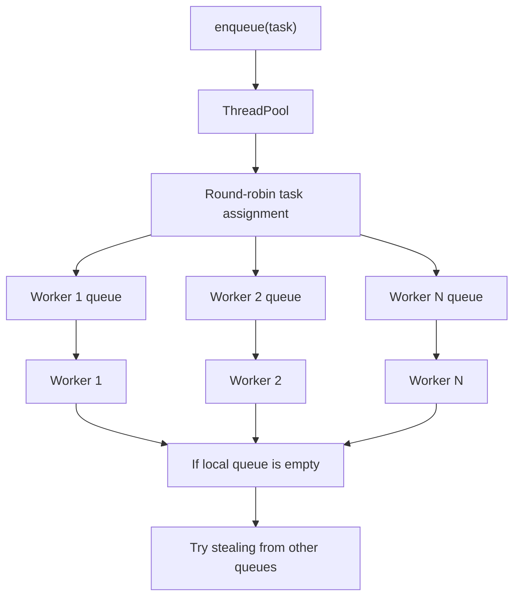
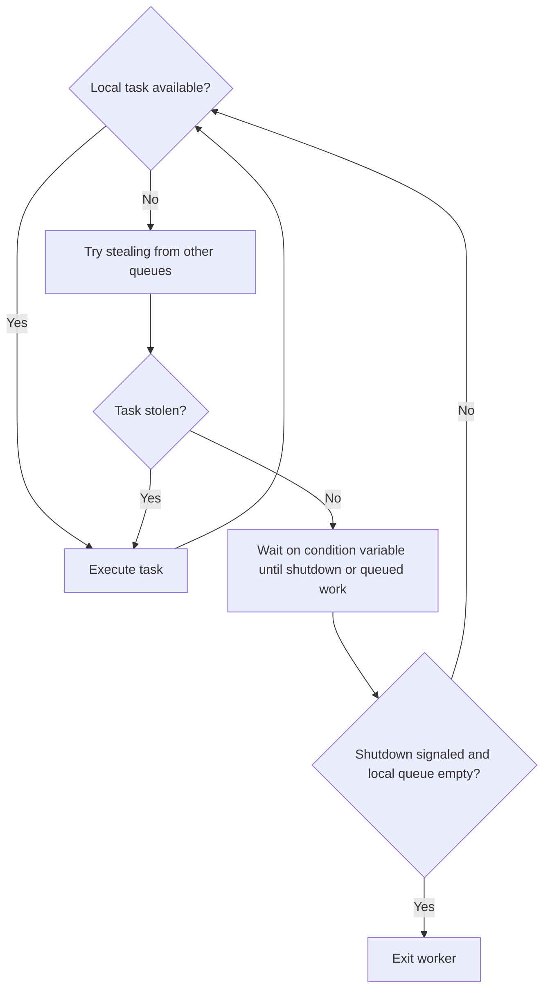

# Multithreaded Task Scheduler

A **C++20 task scheduler** featuring a thread pool, per-worker queues, work stealing, and future-based results. Includes benchmarks exploring CPU scaling, uneven workloads, and scheduling overhead.

The project explores concurrent programming with `std::thread`, mutexes, condition variables, atomics, and explicit memory ordering. The main thread pool uses mutex-protected queues; atomic data structures are separate experiments.

## Build and Usage

Use a C++20-capable compiler and CMake 3.22 or newer for development. The current CMake file declares a minimum of 3.20.

From the repository root, create a Debug build so test assertions remain enabled:

```bash
cmake -S . -B build-debug -DCMAKE_BUILD_TYPE=Debug
cmake --build build-debug -j
./build-debug/task_scheduler
```

The demo shows multiple return types, asynchronous task execution, and exception propagation through futures.

### Submit a Task

```cpp
#include "ThreadPool.h"
#include <iostream>

int main() {
    ThreadPool pool(4);

    auto result = pool.enqueue([] {
        return 21 * 2;
    });

    std::cout << result.get() << '\n'; // Prints 42.
}
```

`enqueue` accepts a callable with no arguments and returns a future for its result. Capture task inputs in the callable; `future.get()` waits for completion and rethrows any exception captured from the task. Construct the pool with at least one worker.

See [src/main.cpp](src/main.cpp) for a larger example.

## Architecture

Submissions are assigned to worker queues in round-robin order. Each worker first checks its own queue, then attempts to steal work from other queues.



- **Per-worker queues:** Each queue has its own mutex. Workers pop from the front of their local queue and steal from the back of another queue.
- **Task results:** `std::packaged_task` wraps each callable and delivers its result or exception through `std::future`.
- **Idle workers:** A condition variable lets workers sleep when no queued work is found.
- **Lifetime:** The destructor signals shutdown and joins worker threads. Shutdown behavior is exercised by the thread-pool stress test; synchronization limitations are listed below.

Implementation: [ThreadPool](src/ThreadPool.cpp) and [TaskQueue](src/TaskQueue.cpp).

### Worker Loop

After executing a task, each worker checks its local queue again. If neither a local pop nor a steal succeeds, it waits on a condition variable. The wait predicate allows it to continue immediately when shutdown is signaled or any queue has work.



This shows the current control flow; the potential missed-wakeup race is documented under [Limitations and Future Work](#limitations-and-future-work).

## Benchmarks

### Run Locally

Use a separate build for performance measurements:

```bash
cmake -S . -B build
cmake --build build -j
./build/benchmark
./build/uneven-task-benchmark
./build/tiny-task-benchmark
```

Each executable runs sequential execution and configurations of 1, 2, 4, and 8 workers, with 10 runs per configuration.

### Recorded Results

The following averages are preserved from the [saved benchmark results](benchmarks/results/Final). They were recorded on an **Apple Silicon Mac**, with **10 runs per configuration**.

Speedup is sequential time divided by parallel time. Parallel efficiency is speedup divided by worker count, multiplied by 100.

#### Prime Counting

Counts primes in the range `[2, 5,000,000)`, divided into 16 tasks for parallel execution.

| Workers | Average Time | Speedup | Efficiency |
| ---: | ---: | ---: | ---: |
| Sequential | 720.4 ms | 1.00× | — |
| 1 | 720.1 ms | 1.00× | ~100% |
| 2 | 387.0 ms | 1.86× | 93.1% |
| 4 | 212.3 ms | 3.39× | 84.8% |
| 8 | 161.5 ms | **4.46×** | 55.8% |

Execution time improved through eight workers while parallel efficiency decreased. Possible contributors include scheduling overhead, contention, and the machine's CPU configuration; these measurements do not isolate their individual effects.

#### Uneven Workloads

Runs 16 tasks with workloads ranging from 1,000,000 to 90,000,000 loop iterations.

| Workers | Average Time | Speedup |
| ---: | ---: | ---: |
| Sequential | 444.4 ms | 1.00× |
| 1 | 443.8 ms | 1.00× |
| 2 | 237.9 ms | 1.87× |
| 4 | 133.8 ms | 3.32× |
| 8 | 100.5 ms | **4.42×** |

The benchmark records task counts, assigned workload, and task execution time per worker. Work stealing allows idle workers to claim queued tasks, but these results do not quantify its benefit independently. That requires a comparison with stealing disabled under the same conditions.

#### Tiny-Task Overhead

Submits 100,000 tasks, each performing a simple multiplication.

| Configuration | Average Time | Slowdown vs. Sequential |
| --- | ---: | ---: |
| Sequential | 336.1 µs | 1.00× |
| 1 worker | 111,141 µs | 330.7× |
| 2 workers | 111,844 µs | 332.8× |
| 4 workers | 112,702 µs | 335.3× |
| 8 workers | 108,909 µs | 324.0× |

For this workload, task submission, futures, synchronization, and result collection cost far more than the computation itself. **Tasks need enough useful work to amortize scheduling overhead.**

Timing boundaries differ across benchmarks: prime counting includes pool construction; uneven and tiny-task timings exclude it. Uneven-workload timing also includes per-worker reporting. All three exclude pool destruction.

## Testing

Run the standalone stress tests from the Debug build:

```bash
./build-debug/thread_pool_tests
./build-debug/work_stealing_deque_test
./build-debug/lock_free_queue_test
```

| Program | Coverage |
| --- | --- |
| `thread_pool_tests` | Task-completion counts after pool destruction, from 100 to 100,000 tasks |
| `work_stealing_deque_test` | 100,000 preloaded tasks consumed by one owner and three thieves; checks missing and duplicate executions |
| `lock_free_queue_test` | Four producers insert 100,000 tasks, followed by four concurrent consumers |

Additional worker-distribution and queue demonstrations:

```bash
./build-debug/work_stealing_test
./build-debug/worker_distribution_test
./build-debug/task_queue_test
./build-debug/task_queue_steal_test
```

Tests are currently standalone programs. Some report failure through console output while still returning exit code zero. Inspect their output; successful stress runs do not establish correctness for every concurrent execution. The experimental tests do not cover overlapping production and consumption or deque slot reuse under concurrent pushes.

### Experimental Data Structures

- [LockFreeTaskQueue](src/LockFreeTaskQueue.cpp) explores atomic compare-and-swap operations and deferred node reclamation. Despite its name, it removes the most recently inserted task first (LIFO).
- [WorkStealingDeque](src/WorkStealingDeque.cpp) explores a bounded buffer with owner-pop and thief-steal operations using explicit memory ordering and atomic shared-pointer operations.

These components are separate from the main thread pool. Their atomic operations and passing stress tests do not establish an end-to-end lock-free guarantee.

## Limitations and Future Work

Correctness and validation priorities:

- Fix a potential missed-wakeup race: submission and shutdown update the worker wait conditions without holding the condition-variable mutex, allowing a notification to occur between a predicate check and sleeping.
- Reject zero-worker construction; submitting to such a pool currently attempts modulo by zero.
- Add tests for idle-to-active transitions, shutdown, concurrent producers and consumers, and deque slot reuse, plus sanitizer checks.
